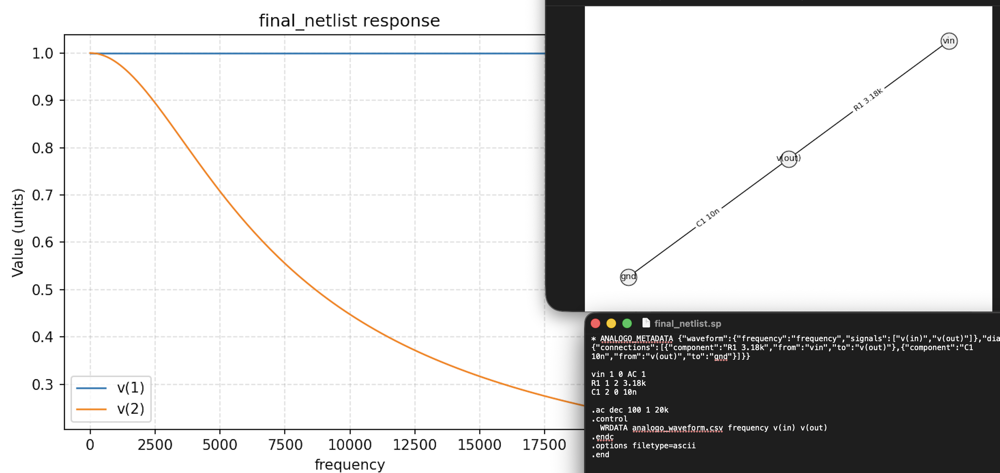

# Analogo



Analogo is an autonomous AI agent that designs analog circuits with the help of OpenAI models and
NGSpice simulations. Give it a natural-language description such as:

> “Design an RC lowpass filter with 8kHz cutoff frequency for input voltage 0-1V, and mak 20KHz.”

The agent will:

1. Use the OpenAI API to propose a SPICE design.
2. Run NGSpice in batch mode to simulate the circuit.
3. Parse the results, learn from the failures, and iterate until the specification is met or the
   iteration limit is reached.
4. Produce artifacts for the final working circuit: waveform plot (with the simulated input and output node voltages), circuit diagram image, SPICE netlist, and NGSpice output log, and—when `ANALOGO_SHOW_VISUALS=1`—automatically pop those images open as the run progresses.

## Requirements

- Python 3.10+.
- [NGSpice](https://ngspice.sourceforge.io) accessible on your `PATH`.
- An OpenAI API key available via the `OPENAI_API_KEY` environment variable.

### macOS Quick Start

```bash
brew install ngspice
python3 -m venv .venv
source .venv/bin/activate
pip install -r requirements.txt
```

## Usage

```bash
python -m analogo.cli "Design an RC lowpass filter with 8kHz cutoff frequency for input voltage 0-1V, and mak 20KHz"
```

Command-line flags:

| Flag | Description | Default |
| --- | --- | --- |
| `--iterations` | Maximum number of design/simulation cycles | `5` |
| `--model` | OpenAI model ID | `gpt-4o-mini` |
| `--temperature` | Sampling temperature | `0.2` |
| `--output` | Directory for run artifacts | `runs/` |

Each run creates a timestamped folder in the output directory containing per-iteration artifacts
(`circuit.sp`, `circuit.log`, `diagram.png`, `waveform.png`). The waveform image overlays the input and
output voltages so you can quickly verify behavior. The latest iteration is promoted to
`runs/<timestamp>/final` for quick access.

### Live monitoring

- Every LLM response (the agent's "thinking") is printed to the terminal and appended to `runs/<timestamp>/agent_thinking.txt` so you can review the full reasoning later.
- Set `ANALOGO_SHOW_VISUALS=1` before running the CLI to have Analogo launch the waveform and circuit-diagram PNGs in your desktop image viewer as soon as each simulation finishes.

## How it works

The agent enforces a structured JSON protocol with the LLM. Every proposed netlist must contain a
metadata comment (`* ANALOGO_METADATA {...}`) and a `.control` block that writes waveform data to
`analogo_waveform.csv`, explicitly including the primary input and output nodes. After each NGSpice run the agent summarizes the logs and waveform statistics,
feeds them back to the model, and asks for refinements until the model explicitly finalizes the
design (`status = "final"`). This keeps the loop deterministic and provides enough information to
plot waveforms and render a simple connectivity diagram.
